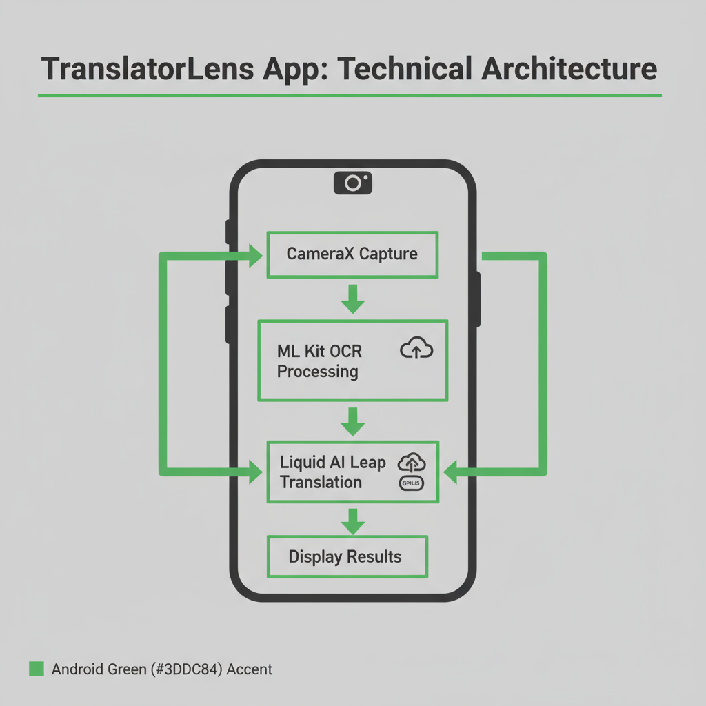

# TranslatorLens: Building An Offline Translation Camera

Author: Mengxiao Lin

This document is mostly generated by [Kimi's OK Computer Agent](https://www.kimi.com).

## Introduction
TranslatorLens is an example Android app that demonstrates the power of combining on-device AI technologies to create practical, privacy-focused applications. This comprehensive guide walks through the step-by-step process of building a translation camera app that operates completely offline, leveraging [Google ML Kit](https://developers.google.com/ml-kit/) for OCR and [Liquid AI Leap Platform](https://leap.liquid.ai/) for local language model.

## Chapter 1: Project Overview and Architecture


### Technical Architecture Deep Dive
The application follows modern Android architecture patterns with clear separation of concerns:

**Camera Layer**: Utilizes CameraX API for efficient camera management, providing real-time preview capabilities and high-quality image capture optimized for OCR processing. The implementation handles lifecycle management automatically and supports various camera configurations.

**OCR Engine**: Google ML Kit's Text Recognition API forms the core text detection capability. The implementation includes bundled models for both Chinese and Latin scripts, processing images at native resolution to ensure optimal accuracy. The OCR engine can detect text blocks, lines, and individual elements with precise bounding box coordinates.

**Translation Layer**: Liquid AI Leap SDK enables local language model inference. In this repo, Qwen3 0.6B model is selected for bidirectional Chinese-English translation.

**UI Layer**: The model download and use case selection page is built with Android's modern Jetpack Compose framework. Main translation camera activity is built with the traditional Android Views, with a custom preview view to visualize OCR result and allow users to touch the text bounding box for requesting translation.

### Key Technologies and Dependencies
- **CameraX**: Lifecycle-aware camera operations with support for preview and capture modes
- **Google ML Kit**: On-device text recognition with multi-language support
- **Liquid AI Leap**: Local language model inference optimized for mobile devices

## Chapter 2: Implementation Deep Dive

### Setting Up the Project Structure
The project follows standard Android app structure with modular organization:

```
app/src/main/java/me/mengxiao/translatorlens/
├── MainActivity.kt                 # Main UI controller
├── LeapModelRunnerHolder.kt        # LLM engine wrapper
├── OCRImagePreviewView.kt          # Custom OCR overlay view
├── OCROnImageCapturedCallback.kt   # OCR processing callback
└── WelcomeActivity.kt              # App initialization, model downloading and management
```

### Camera Integration with CameraX
CameraX provides a simplified API for camera operations while maintaining powerful capabilities. The implementation includes:

**Camera Provider Setup**: ProcessCameraProvider manages camera lifecycle automatically, binding to the activity's lifecycle owner. This ensures proper resource management and prevents memory leaks.

**Preview Configuration**: PreviewView displays real-time camera feed with configurable scale types and implementation modes. The preview is optimized for text recognition by maintaining aspect ratio and providing high-quality image streams.

**Image Capture**: ImageCapture use case configured for high-resolution still images, essential for accurate OCR processing. The implementation supports various output formats and rotation handling.

### OCR Processing with ML Kit
The OCR implementation leverages Google ML Kit's powerful text recognition capabilities:

**Text Recognition Setup**: ChineseTextRecognizerOptions provides specialized models for Chinese character recognition, with automatic fallback to Latin script recognition. The recognizer processes InputImage objects created from camera captures.

**Result Processing**: The OCR engine returns hierarchical text structure including text blocks, lines, and elements. Each detected region includes precise bounding box coordinates for accurate overlay positioning.

**Performance Optimization**: Image preprocessing ensures optimal OCR accuracy by maintaining appropriate resolution and handling rotation correctly. The implementation processes images asynchronously to prevent UI blocking.

### Translation Engine Integration
Liquid AI Leap SDK enables sophisticated local translation capabilities:

**Model Management**: LeapModelRunnerHolder manages language model lifecycle, loading models asynchronously and providing translation interfaces. The implementation supports both Chinese-to-English and English-to-Chinese translation directions by using different prompts.

**Resource Efficiency**: Models are optimized for mobile deployment. The implementation includes proper memory management and cleanup procedures.

## Chapter 3: Code Walkthrough and Implementation Details

### MainActivity: UI Controller and Coordinator
MainActivity serves as the central coordinator, managing camera operations, OCR processing, and translation workflows:

```kotlin
class MainActivity : AppCompatActivity() {
    // Camera components
    private lateinit var cameraProviderFuture: ListenableFuture<ProcessCameraProvider>
    private lateinit var previewView: PreviewView
    private lateinit var imageCapture: ImageCapture

    // OCR and translation components
    private lateinit var frozenPreviewView: OCRImagePreviewView
    private lateinit var modelRunnerHolder: LeapModelRunnerHolder

    // Translation workflow
    private lateinit var translationCase: TranslationCase
    private var isTranslating = false
}
```

The activity initializes camera components in `onCreate()`, sets up click listeners for capture/reset operations, and manages the overall translation workflow. It implements proper lifecycle management and resource cleanup.

### OCR Processing Pipeline
OCROnImageCapturedCallback handles the complete OCR processing pipeline:

```kotlin
class OCROnImageCapturedCallback(
    private val onBitmapReady: (Bitmap) -> Unit,
    private val onOCRResultReady: (List<OCRDetectedTextBlock>) -> Unit
) : ImageCapture.OnImageCapturedCallback()
```

The callback processes camera images through several stages:
1. Image capture from CameraX
2. InputImage creation for ML Kit
3. Text recognition using ChineseTextRecognizerOptions
4. Result parsing into OCRDetectedTextBlock objects
5. Bitmap rotation and preparation for display

### Translation Engine Wrapper
LeapModelRunnerHolder provides a clean interface for translation operations:

```kotlin
class LeapModelRunnerHolder(coroutineScope: CoroutineScope, modelPath: String) {
    suspend fun translateChineseToEnglish(text: String): String
    suspend fun translateEnglishToChinese(text: String): String
}
```

The wrapper handles model initialization, conversation management, and streaming response processing. It ensures thread-safe operations and proper resource management.

### Custom OCR Overlay View
OCRImagePreviewView extends Android's ImageView to provide interactive OCR visualization:

```kotlin
class OCRImagePreviewView @JvmOverloads constructor(
    context: Context, attrs: AttributeSet? = null
) : AppCompatImageView(context, attrs) {

    interface OnOCRBoundingBoxClickListener {
        fun onBoundingBoxClick(text: String, boundingBox: RectF)
    }

    fun setOCRResult(results: List<OCRDetectedTextBlock>)
}
```

The custom view handles text block rendering, user interaction, and coordinate transformation between image and display coordinates.

## Chapter 4: Advanced Features and Optimization

### Offline Capabilities and Model Management
The app maintains complete offline functionality through careful model management:

**Bundled Models**: OCR models are bundled with the app, ensuring immediate availability. Translation models can be downloaded on first use.

### Future Enhancement Opportunities
Several areas offer opportunities for enhancement:

**Additional Language Support**: The architecture easily extends to support additional language pairs by integrating more language models.

**Real-time Translation**: CameraX's ImageAnalysis use case enables real-time OCR and translation for live camera feeds.

**Advanced OCR Features**: ML Kit supports handwriting recognition, document scanning, and barcode reading for expanded functionality.

**Model Customization**: Liquid AI Leap supports model fine-tuning for domain-specific translation tasks.

## Conclusion

TranslatorLens demonstrates the power of combining modern mobile AI technologies to create practical, privacy-focused applications. By leveraging Google ML Kit's robust OCR capabilities and Liquid AI's efficient local language models, developers can build sophisticated translation tools that work entirely offline.

This approach not only ensures user privacy and data security but also provides reliable performance regardless of network conditions. The project's success showcases how emerging edge AI technologies are making it possible to run complex AI tasks directly on mobile devices, opening new possibilities for offline-first applications.

## Resources and References

- [TranslatorLens GitHub Repository](https://github.com/linmx0130/TranslatorLens)
- [Google ML Kit Documentation](https://developers.google.com/ml-kit)
- [Liquid AI Leap Platform](https://leap.liquid.ai/)
- [Android CameraX Guide](https://developer.android.com/training/camerax)
- [Jetpack Compose Documentation](https://developer.android.com/jetpack/compose)
